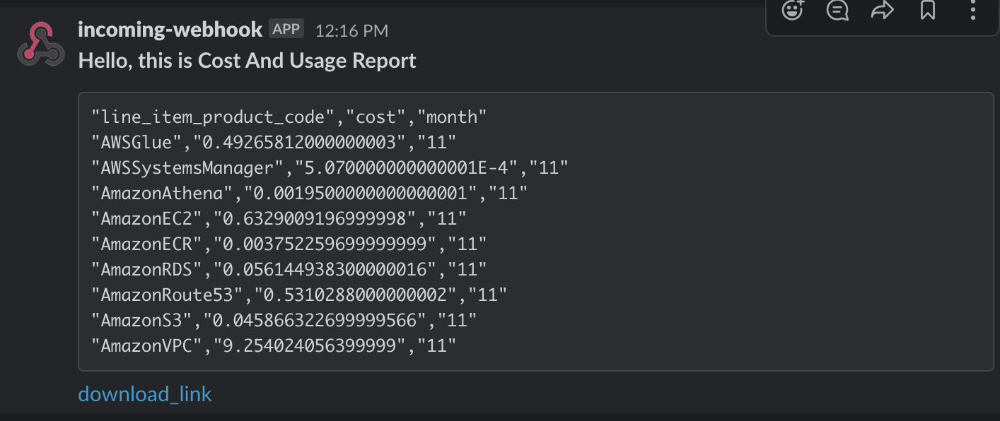

## 目的
- 想要解決的問題 
    - 我知道可以透過 bills 來取得當月的所有花費, 但 bills 僅可以列出到目前為止當月的總量花費, 如何得知每時/日均有持續增加的花費?
- 作法
    - 建立完成 cost and usage report 後
    - 透過 crawler-cfn.yml 建立匯入資料到 Athena 的服務
    - 透過 cur-athena-query-output 的部署, 每時/日執行一次 Athena query summary, 並輸出結果到 SNS
    - 可透過從 sns 中訂閱, 取得報告
    - 透過每日的訂閱報告, 若發生數據資料不正常, 可執行 Athena Detail Query, 來檢查資訊



## 建立順序
1. 在 Cost Management, 建立 cost-and-usage report, 第一次建立需要等待最多 24 小時, 將報告放到 S3
    - [ ] : 設定 `$report_name`, 格式滿足 `小寫`, `單字間用底線隔開`
    - [ ] : 勾選 `Include resource IDs`
    - [ ] : 建立資料存放的 `$rawDataBucket`
    - [ ] : Enable report data integration for = `Athena`
2. 建立此 github 服務, 
    - 目的 : 執行指定 query, 並輸出到 sns
    - 輸入參數
        - Athena
            - AthenaDatabase = `athenacurcfn_$report_name`
            - AthenaWorkgroup = `primary`
            - AthenaTable = `$report_name`
        - S3BucketCostAndUsageRawData = `$rawDataBucket`
        - SNSTopicArn = `...`
3. 部署 整合 athena 的 crawler-cfn.yml : `https://docs.aws.amazon.com/cur/latest/userguide/cur-ate-setup.html`
    1. 安裝完 cfn, 需等待最多八個小時, 讓 cfn 將資料整合到 Athena 資料
    2. 資料產生完畢後, 到 bucket 中, 可找到 AWS 自動建立的 .yml 的 crawler-cfn.yml 設定檔
    3. 下載後, 建立 crawler-cfn.yml
4. 設定 s3 `$rawDataBucket` 中設定 Lifecycle, 避免資料儲存過多
5. 接下來可做什麼? 整合 QuickSight

## 本地測試
1. 設定環境
    - 確定 cloud s3 / athena / cost-and-usage report 均設定完成
    - `export AWS_REGION=ap-southeast-1`
    - `export AWS_PROFILE=default`
2. 執行 lambda


## 如何查詢更詳細的指定項目?

```
SELECT 
    line_item_operation, 
    line_item_resource_id, 
    line_item_usage_type,
    line_item_usage_start_date,
    line_item_usage_end_date,
    product_location,
    product_product_family,
    pricing_public_on_demand_cost,
    pricing_public_on_demand_rate,
    pricing_unit
FROM $AthenaDatabase
WHERE line_item_product_code='$指定的服務' AND year='%s' AND month='%s'
ORDER BY identity_time_interval
```

- ex : $指定的服務 = AmazonVPC
- 欄位可換


